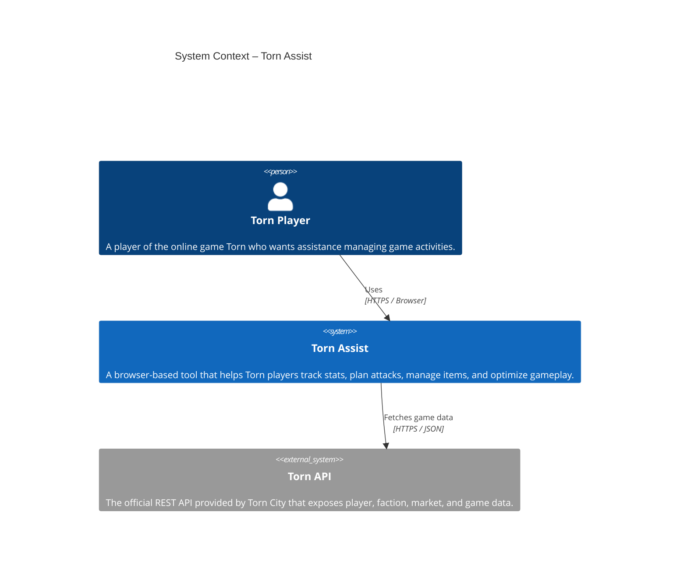
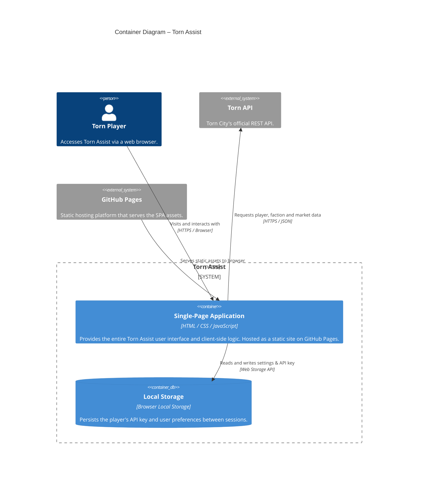

# Torn Assist – Architecture

This document describes the high-level architecture of the Torn Assist system using C4 diagrams (context and container views) expressed in [Mermaid](https://mermaid.js.org/) format.

---

## C4 Context Diagram

The context diagram shows **who** interacts with Torn Assist and **what external systems** it depends on.

---

## C4 Container Diagram

The container diagram shows the **internal building blocks** of Torn Assist and how they interact.

---

## Notes

| Term | Meaning |
|------|---------|
| **SPA** | Single-Page Application – the entire front-end runs in the browser with no server-side component. |
| **Torn API** | Third-party API owned by Torn City Ltd; requires an API key provided by the player. |
| **GitHub Pages** | Free static-site hosting used to deploy Torn Assist; no custom back-end is required. |
